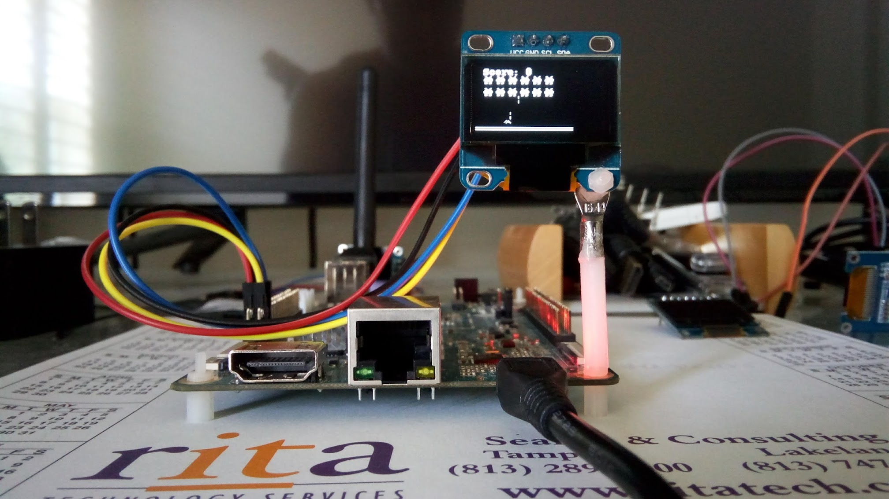

Java U8g2 is a high performance library based on [U8g2](https://github.com/olikraus/u8g2): Library for monochrome displays, version 2.
Rather than try to code the JNI by hand I used [HawtJNI](https://github.com/fusesource/hawtjni)
to generate the JNI wrappers. I also used some custom code to generate the HawtJNI methods and font constants.
This makes life easier going forawrd as changes are simple to keep in sync.
* Latest JDK 17 LTS supported on all platforms except ARM32 which only supports JDK 11 LTS.
* Generates JNI source code for U8g2.
* Generates an autoconf and msbuild source project to build the native library.
This gets attached to the Maven project as as the native source zip file.
* Builds the native source tar for the current platform.
* Built native library is stored in a platform specific jar. This gets attached
to the Maven project as a platform specific jar file.
* Build code on target platform, no cross compiling required.
* Java code follows C API, so if you used U8g2 in C or even NodeMcu with Lua it
will immediately be familar. No goofy Java wrapper with a totally different API.

I submitted a [PR](https://github.com/olikraus/u8g2/pull/1666) that allows state
of GPIO chip, I2C and SPI busses to be stored in u8x8_struct. This should allow
multiple displays, but it is still limited to one bus.

```
final var u8g2 = U8g2.initU8g2();
// Change this to your actual display
U8g2.setupSsd1306I2c128x64NonameF(u8g2, U8G2_R0, u8x8_byte_arm_linux_hw_i2c, u8x8_arm_linux_gpio_and_delay);
U8g2.setGpioChip(u8g2, 0);
U8g2.setI2cBus(u8g2, 0);
U8g2.setI2CAddress(u8g2, 0x3c * 2);
U8g2.initDisplay(u8g2);
logger.debug(String.format("Size %d x %d, draw color %d", U8g2.getDisplayWidth(u8g2), U8g2.getDisplayHeight(u8g2), U8g2.
        getDrawColor(u8g2)));
U8g2.setPowerSave(u8g2, 0);
U8g2.clearBuffer(u8g2);
U8g2.setFont(u8g2, u8g2_font_t0_15b_mf);
U8g2.drawStr(u8g2, 1, 18, "Java U8g2");
U8g2.sendBuffer(u8g2);
try {
    TimeUnit.SECONDS.sleep(5);
} catch (InterruptedException ie) {
    Thread.currentThread().interrupt();
}
U8g2.setPowerSave(u8g2, 1);
U8g2.doneI2c();
U8g2.donePins();
```



## SBC configuration
* If you are using Armbian then use `armbian-config` or edit `/boot/armbianEnv.txt`
to configure various devices. Userspace devices are exposed through /dev or
/sys. Verify the device is showing up prior to trying demo apps.
    * `sudo apt install armbian-config`
* If you are not using Armbian then you will need to know how to configure
devices to be exposed to userspace for your Linux distribution and SBC model.
Check each log in scripts directory to be sure there were no errors after running
install.sh.
* For I2C displays
    * `sudo apt install i2c-tools`
    * `i2cdetect -l`
    * `i2cdetect -y 1`
* I have tested 32 bit and 64 bit boards using the latest Armbian release or in
the case of the Raspberry Pi Ubuntu Server. The ability to switch seamlessly
between boards gives you a wide range of SBC choices. I'm currently testing with
Ubuntu 20.04 LTS Focal Fossa using 5.10 kernels.

## Non-root access
If you want to access devices without root do the following (you can try udev
rules instead if you wish):
* `sudo groupadd u8g2`
* `sudo usermod -a -G u8g2 username` (Use a non-root username)
* `ls /dev/gpio*` (Note chip names to add below)
* `ls /dev/spidev*` (Note SPI channels below)
* `ls /dev/i2c*` (Note i2c devices below)
* `sudo nano /etc/rc.local`
<pre><code>chown -R root:u8g2 /dev/gpiochip* #/dev/gpiomem for sandbox
chmod -R ug+rw /dev/gpiochip* #/dev/gpiomem for sandbox
chown -R root:u8g2 /dev/i2c*
chmod -R ug+rw /dev/i2c*
chown -R root:u8g2 /dev/spidev*
chmod -R ug+rw /dev/spidev*</code></pre>

## Download project
* `sudo apt install git`
* `cd ~/`
* `git clone --depth 1 https://github.com/sgjava/java-u8g2.git`

## Install script
The install script assumes a clean OS install. If you would like to install on
a OS with your own version of Java 17, etc. then you can look at what install.sh
does and do it manually. What does the script do?
* Install build dependencies for HawtJNI 
* Installs Zulu OpenJDK 17 to /usr/lib/jvm (JDK 11 is used for ARM32)
* Installs Maven to /opt
* Build HawtJNI (using my fork that works with JDK 17)
* Build Java U8g2

### Run script
* `cd ~/java-u8g2/scripts`
* `./install.sh`
* Check various log files if you have issues running the demo code. Something
could have gone wrong during the build/bindings generation processes.
* If you need to recompile use `mvn clean install -Dmaven.compiler.source=11 -Dmaven.compiler.target=11` on ARM32.

## Run demos
* `java -cp $HOME/java-u8g2/target/java-u8g2-1.0.0-SNAPSHOT.jar:$HOME/java-u8g2/target/java-u8g2-1.0.0-SNAPSHOT-linux64.jar com.codeferm.u8g2.demo.Text`

Note that the native library jar has a suffix such as linux32, so depending on
your target platform it could be different. To see a list of demos 
[browse](https://github.com/sgjava/java-u8g2/tree/master/src/main/java/com/codeferm/u8g2/demo)
code.

## Use Java u8g2 in your own Maven projects
After bulding Java u8g2 simpily add the following artifact:
```
<groupId>com.codeferm</groupId>
<artifactId>java-u8g2</artifactId>
<version>1.0.0-SNAPSHOT</version>
```
